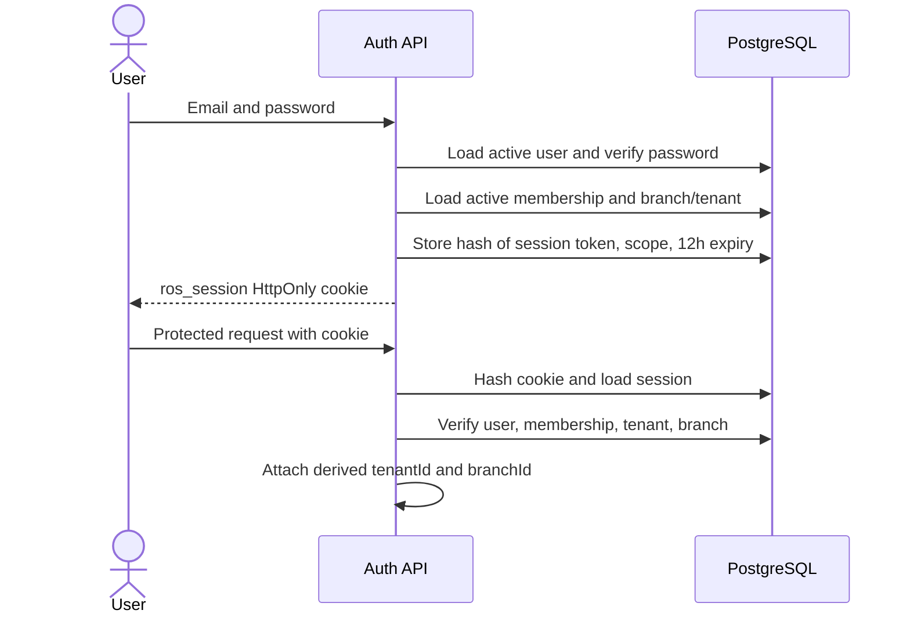
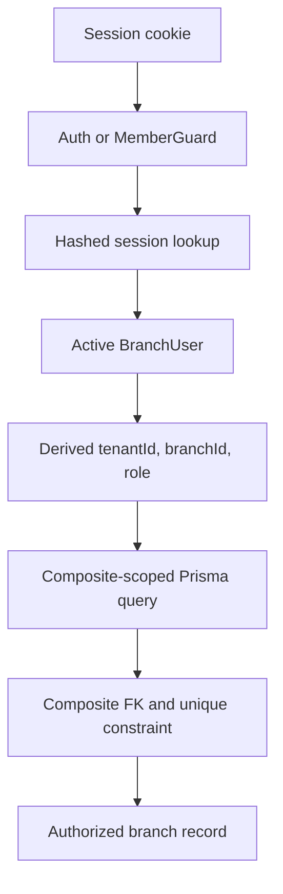

# API, authentication, and tenant isolation

## API boundary map

The browser uses one public origin and calls NestJS through /api. Routes have three authorization domains.

### Public customer routes

Prefix: /public/:kind/:token, where kind q is a permanent service-point QR and s is a session QR.

- GET /menu resolves the QR and returns the active branch menu.
- POST /orders creates an idempotent order.
- GET /orders/:id returns an order only when it belongs to the QR destination or session.
- GET /orders/:id/promptpay returns instructions for a pending PromptPay order.
- POST /orders/:id/payment-claim submits a manual-review signal.
- POST /orders/:id/payment-slip accepts a JPEG or PNG slip when private S3 storage is configured. It performs image/QR checks and submits the claim for staff review.

The token is a limited capability. An order ID alone is insufficient because reads and payment claims are constrained to the resolved token context.

### Authenticated restaurant routes

/staff covers active orders, history, reports, payment confirmation, claim rejection, refunds, sessions, and SSE. /admin covers categories, products, availability, service points, menus, and configuration. /restaurant covers branch settings, presets, onboarding, staff, invitations, and branches.

GET /staff/orders/:id/payment-slip returns a five-minute S3 viewing URL only after branch membership and order scope are checked.

Controller decorators are the transport source of truth. Protected resource lookups include request tenant and branch scope.

### Platform routes

/platform requires the global OPERATOR role and exposes a minimal platform view. Platform authorization is separate from branch membership.

## Authentication lifecycle

The cookie is HttpOnly, SameSite Strict, path /, expires after 12 hours, and is Secure in production. Logout deletes the session and clears the cookie. Password reset changes the password and invalidates existing sessions.

## Roles

| Role     | Intended boundary                                                                |
| -------- | -------------------------------------------------------------------------------- |
| OWNER    | Full setup, branches, staff, settings, reports, and orders                       |
| MANAGER  | Menu, service points/sessions, orders, reports, and operational administration   |
| STAFF    | Daily orders, sessions, payment confirmation, and permitted availability changes |
| OPERATOR | Minimal SaaS tenant/subscription oversight, separate from restaurant membership  |

Controllers call requireRole for stronger actions. Authentication alone does not authorize an arbitrary restaurant resource.

## Tenant isolation model

The application uses shared PostgreSQL tables with explicit tenant and branch columns.

Defense is layered:

1. The client does not select authoritative tenant scope.
2. Guards derive scope from the stored session and active membership.
3. Services filter by tenant, branch, and resource ID.
4. Composite relations ensure child and parent scope agree.
5. Common indexes begin with tenant and branch.

Knowing another tenant UUID should be insufficient to read, change, or attach its records. Integration tests cover representative cross-tenant and cross-branch attempts.

## Public QR security

Service-point and session routes use random UUID tokens instead of enumerable IDs. Permanent tokens can be regenerated. Temporary tokens reject new orders after closure. Tenant and branch active state are checked during resolution, and the destination is locked and re-resolved inside order creation to prevent closure or token rotation racing submission.

QR possession intentionally permits customer ordering at that destination. This creates an abuse surface, so token rotation, session closure, rate limits, monitoring, and staff cancellation matter. QR tokens never grant staff or admin access.

## Request defenses

- Strict Zod schemas constrain strings, UUIDs, arrays, quantities, notes, prices, and enums and reject unknown fields.
- Non-read requests require the configured exact Origin and JSON content type.
- Middleware adds Cache-Control no-store and X-Content-Type-Options nosniff.
- In-process per-IP write limits have stricter login and reset buckets.
- Reset, invite, and auth tokens are random; only hashes are stored.
- Public order reads require token context and order ID.
- Prisma parameterization is used for ordinary and row-lock queries.

## Current security limitations

- Rate limiting is per process and trusts socket address rather than forwarded headers.
- PostgreSQL row-level security is not enabled; isolation depends on scoped code plus composite constraints.
- Session cleanup has no dedicated scheduled housekeeping job.
- CSP and browser headers are minimal; Caddy adds frame, referrer, and content-type headers.
- QR abuse detection and audit logging are limited.
- Email availability depends on Resend configuration and delivery health.

Before multiple API replicas, use shared rate limiting and event transport and define trusted-proxy behavior. Before broader use, add security-event logging, wider permission tests, secret rotation, dependency scanning, and incident response.
