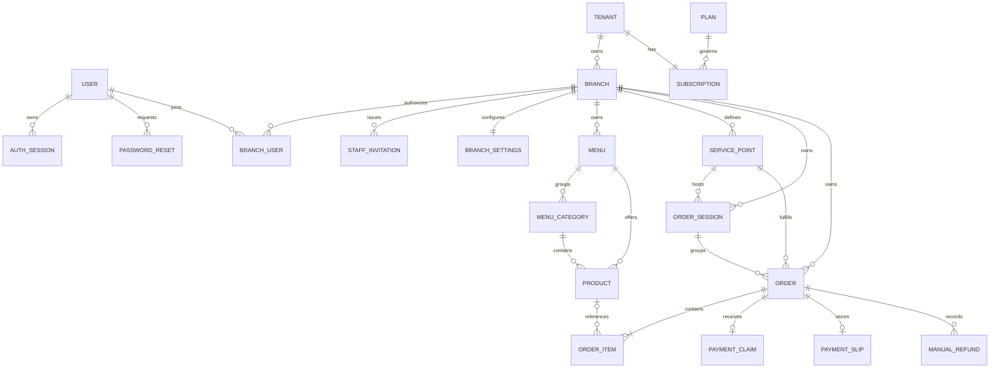

# Data model

The Prisma schema at packages/prisma/prisma/schema.prisma is authoritative. PostgreSQL uses shared tables for all tenants. Tenant and branch scope is repeated deliberately so queries filter efficiently and composite foreign keys reject cross-boundary relationships.

## Entity relationship overview



## Identity and access

### User

Global login identity with unique email, password hash, active state, and platform role USER or OPERATOR. Restaurant authority comes from memberships, not the user row.

### AuthSession

Stores a SHA-256 token hash, user, selected tenant/branch, expiry, and creation time. The raw token exists only in the cookie. Indexes support user-session revocation and expiry lookup.

### PasswordReset

One-time hashed reset token with user and expiry. Indexes support per-user management and expiry lookup.

### BranchUser

Joins a user to a tenant/branch with OWNER, MANAGER, or STAFF and an active flag. User and branch are unique together. The composite branch relation ensures tenant and branch agree.

### StaffInvitation

Branch-scoped invitation with email, role, unique token hash, expiry, and acceptance time. One current invitation may exist per tenant, branch, and email.

## SaaS ownership and configuration

### Tenant

Restaurant account with globally unique slug and ACTIVE or SUSPENDED status. It owns branches, memberships, and one subscription.

### Plan and Subscription

Plan stores identifier, name, active flag, and branch limit. Subscription links one tenant to one plan and stores TRIAL, ACTIVE, PAST_DUE, or CANCELLED plus trial and current-period end times. These represent entitlement data; there is no automatic billing scheduler or provider transaction model.

### Branch

Operational location owned by one tenant. It stores name, tenant-unique slug, optional address, IANA timezone, active state, and an atomic nextOrderNumber. Composite uniqueness on tenantId and id supports branch-scoped foreign keys.

### BranchSettings

One row per branch with preset, four workflow dimensions, and the PromptPay recipient ID. Order and session flows read settings authoritatively.

## Menu

### Menu

Branch-owned named menu with active state. The schema permits multiple menus; current administration generally operates on the branch main menu.

### MenuCategory

Belongs to the same tenant, branch, and menu through a composite relation. sortOrder controls display. Inactive categories are excluded from public ordering.

### Product

Belongs to a menu and category in the same tenant/branch. Price is Decimal(10,2). active false removes it from the current offering; available false is temporary sold-out state. Both are checked again during submission.

## Fulfillment destinations and visits

### ServicePoint

Named location with type, description, active state, and globally unique random QR token. Name is unique within a branch. Deactivation prevents new permanent-QR orders while preserving history.

### OrderSession

Optional visit/grouping record with opaque token, optional service point, label/description, open/closed state, timestamps, aggregate subtotal, and checkout payment fields. Its composite relation prevents attachment to a service point from another branch.

## Orders and money

### Order

Independent order with destination/session links, location snapshot, branch order number, idempotency key and payload hash, fulfillment state, payment fields, decimal subtotal/total, and timestamps.

Important constraints:

- tenantId plus requestKey is unique for duplicate protection.
- tenantId plus branchId plus orderNumber is unique for visible numbering.
- branch/status/date, session/date, and payment-status/paid-date indexes support dashboards and reports.
- composite destination relations prevent cross-tenant or cross-branch attachment.

### OrderItem

Stores tenant/branch/order scope, optional current product reference, immutable name and price snapshots, quantity, note, and decimal line total. Optional product linkage preserves history through catalog changes.

### PaymentClaim

One optional claim per order with customer reference/note, SUBMITTED, VERIFIED, or REJECTED state, and staff review metadata. It is a review signal, not proof that funds settled.

### PaymentSlip

One optional customer image per PromptPay order. PostgreSQL stores a private S3 object key, normalized JPEG size/type, image hash, optional decoded QR hash, QR-readability flag, duplicate warning, and upload time. The raw QR contents and object key never appear in public order responses. Replacing a slip updates this row and removes the previous object after the database transaction. A slip submits a claim but never changes payment status.

### ManualRefund

Operational workflow attached to an order. It stores amount, cash or bank-transfer method, pending/completed/cancelled state, reason, optional transfer reference, actor identifiers, and timestamps. Logic prevents pending plus completed refunds exceeding the order total.

## State machines

### Fulfillment

```text
NEW → ACCEPTED → PREPARING → READY → COMPLETED
  ↘       ↘           ↘       ↘
                 CANCELLED
```

Transitions are forward-only except cancellation from active states. Paid orders and closed-session orders have additional cancellation restrictions.

### Payment

```text
PENDING → PAID
PENDING → FAILED
PENDING → CANCELLED
```

Normal flows mainly use PENDING, PAID, and cancellation tied to an unpaid cancelled order. Payment does not follow fulfillment automatically.

### Claim and refund

```text
SUBMITTED → VERIFIED
SUBMITTED → REJECTED → SUBMITTED

PENDING → COMPLETED
PENDING → CANCELLED
```

## Money and time rules

- Product price, order subtotal/total, session subtotal, refund amount, and item snapshots use PostgreSQL numeric through Prisma Decimal.
- JavaScript floating point is not authoritative for persisted totals.
- Timestamps are database datetimes. Branch-local report bounds are derived from the branch IANA timezone.
- Order number allocation increments the branch counter in the order transaction.

## Schema evolution

Migrations live under packages/prisma/prisma/migrations. Migration 202609220001_multi_tenant converts the earlier single-restaurant POC to tenant/branch scope while preserving users, QR destinations, orders, item snapshots, and payment state. Rehearse production migrations on restored backups, especially composite-key, money-field, or enum changes.
