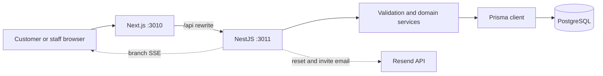
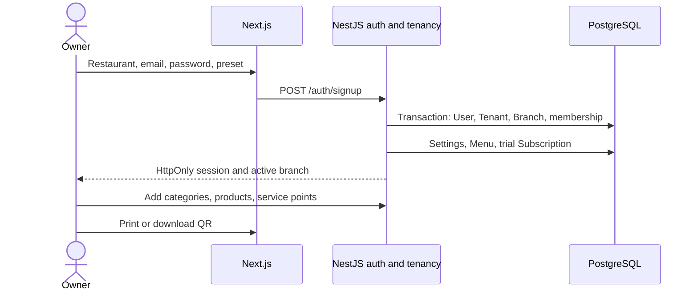
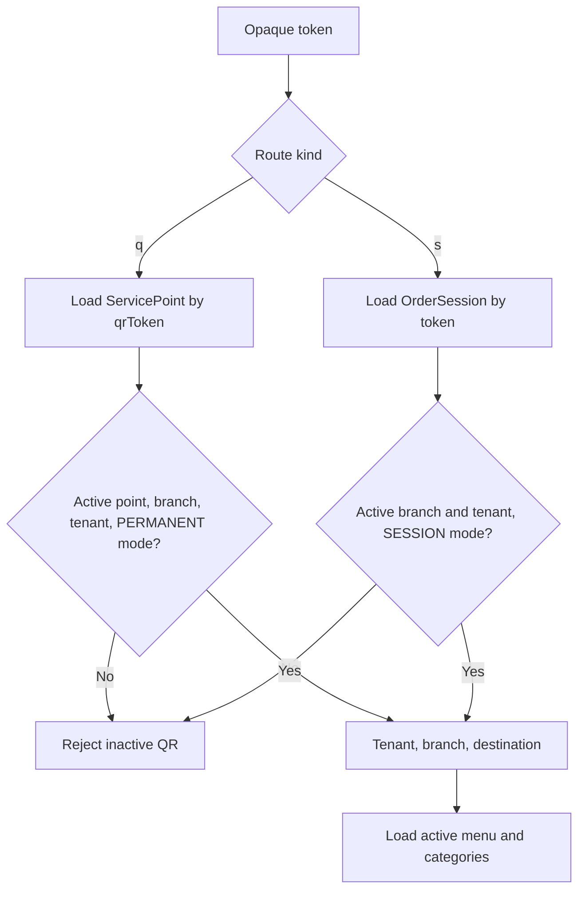
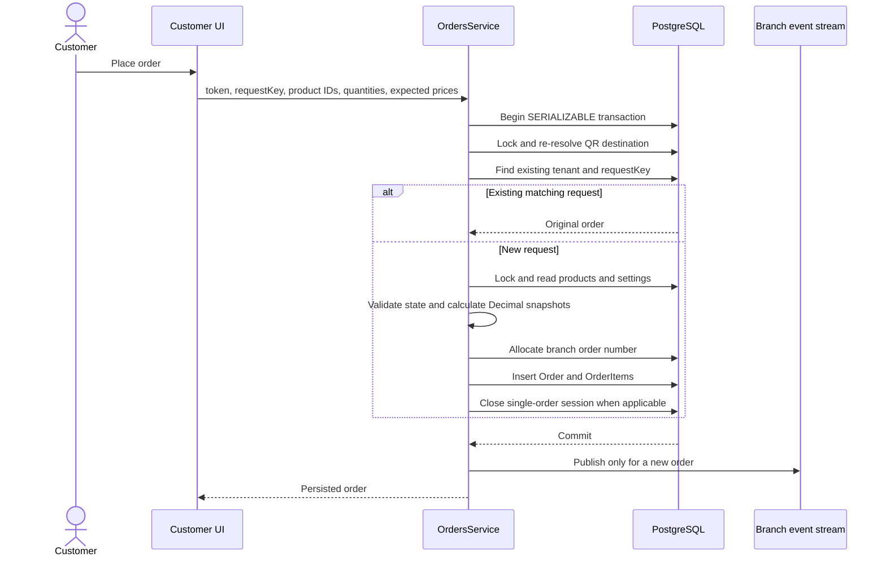
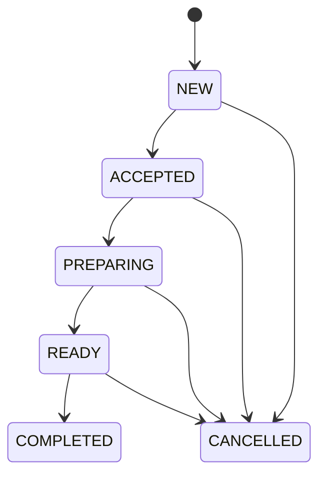

# System flows

This document follows major behavior through the browser, Next.js, NestJS, Prisma, PostgreSQL, and external services.

## Runtime request path

The browser talks to one public origin. Next.js forwards /api routes to NestJS in local and container deployments. Caddy terminates HTTPS and sends pages to Next.js and API paths to NestJS in production.

## Self-service onboarding

Signup creates the first owner, tenant, branch, settings, menu, branch membership, and 30-day trial representation in one transaction. Onboarding progress is derived from persisted setup state rather than a separate workflow engine.

## Authentication and branch selection

Login verifies the password hash, chooses an active branch membership, stores only a hash of the random session token, and returns the raw token in an HttpOnly cookie. The selected tenant and branch are stored on the session. Switching context verifies an active membership in the requested branch before updating the session.

Each protected request passes through a guard that loads the session and membership, rejects expired or inactive data, and attaches user, membership, tenantId, and branchId to the request. Services use that context for object-level authorization.

## Public QR resolution

The token is a narrow public capability. It cannot authenticate staff or choose an arbitrary tenant. Menu access through a session token also rejects a closed session.

## Customer cart and order creation

The cart is browser state. Before submission, the web app creates a UUID request key and persists the exact pending request so a temporary connection failure can safely retry it.

The request hash binds an idempotency key to its original destination, payment choice, and items. Reusing the key with another payload is rejected. Serialization failures and relevant uniqueness races are retried to a bounded limit.

## Session behavior

- Permanent/open-session mode finds or creates an open session for the service point inside order creation.
- Temporary/session QR mode points to an existing session.
- SINGLE_ORDER closes the session after the first accepted order.
- Closing an open session prevents new orders through its temporary QR.
- In AT_CHECKOUT mode, individual orders have no selected payment method; staff closes the session with cash or PromptPay and confirms the session subtotal.
- Moving a session changes its service point and description while retaining its token.

## Staff fulfillment

The API validates every transition. Completed and cancelled orders are terminal. A paid order cannot be cancelled through the normal action because money must be handled explicitly. Orders in a closed session also cannot be cancelled.

The dashboard loads state from the database, listens to branch-scoped SSE, and polls every 15 seconds. Events invalidate the query. Sound requires staff interaction and plays only for genuinely new order IDs after initial load.

## Per-order payments

### Cash

The order starts PENDING. Staff collects cash and explicitly confirms receipt. Confirmation records PAID, paidAt, and the confirming user. No customer claim is required.

### PromptPay

NestJS generates an amount-specific PromptPay payload and SVG from the branch PromptPay ID and server-calculated total. The customer can report that payment was sent with an optional reference and note. This creates or refreshes a PaymentClaim but does not mark the order paid.

Staff inspect the restaurant bank account, match amount, reference, and time, and enter the bank transaction reference. Only that action changes payment to PAID and the claim to VERIFIED. A mismatch can mark the claim REJECTED while payment remains pending.

See [Payments](PAYMENTS.md) for evidence upload and automatic verification options.

## Refunds

A refund is a separate record attached to a paid order. Creation verifies that pending plus completed refunds do not exceed the order total. Cash or bank-transfer completion is manual; bank transfer requires a reference. Completion states that money was returned outside the app. It does not send money or rewrite the original paid order.

## Reports

Reports are branch-scoped and use the branch timezone for the local day. Today summary counts non-cancelled orders, sums confirmed cash and PromptPay from per-order and at-checkout session payments, and lists top product snapshots. This is operational reporting, not tax or accounting software.

## Subscription behavior

Signup creates a trial subscription linked to a seeded plan. Branch creation reads the plan branchLimit. There is no scheduler, invoicing, automatic collection, reminder notification, or automatic trial-expiry transition. See [Subscriptions](SUBSCRIPTIONS.md).

## Email flows

Password resets and invitations create random tokens, store SHA-256 hashes, enforce expiry, and send links through Resend. RESEND_API_KEY and EMAIL_FROM enable delivery. Token pages use Referrer-Policy no-referrer. Password reset invalidates existing sessions.
